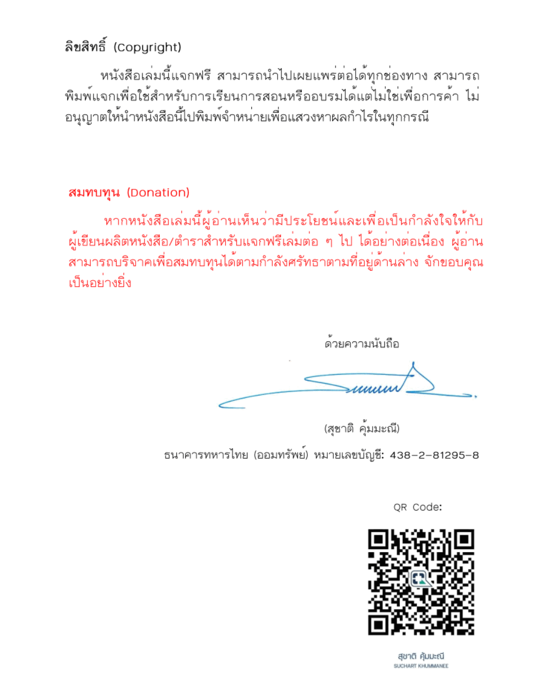

# หนังสือ Python-Programming-Networking-Security
หนังสือการเขียนโปรแกรมไพธอนสำหรับระบบเครือข่ายและความปลอดภัย 

Python Programmming for Networking and Security

เขียนโดย ผศ.ดร.สุชาติ  คุ้มมะณี 

ขอขอบพระคุณท่านอาจารย์ที่ให้ความอนุเคราะห์ในการดาวน์โหลดหนังสือเล่มนี้ได้ฟรี ใครมีจิตศรัทธาอยากจะร่วมสมทบทุนให้กับท่านอาจารย์ก็สามารถร่วมกันบริจาคได้ตามจิตศรัทธาครับ ขอบคุณครับ

